# 1	Einleitung
In den letzten Jahren ist das Themengebiet der künstlichen Intelligenz durch stetige Fortschritte in den Fokus der 
Bevölkerung gerückt. Die Leistungsfähigkeit und breite Anwendungsmöglichkeit von maschinellem Lernen zeigt sich in vielen 
verschiedenen Bereichen, wie beispielsweise in den Spielen, Go und StarCraft, in welchen Computer 
ihren menschlichen Gegenspieler überlegen sind, aber auch in anderen Bereichen wie der Medizin und Bildbearbeitung. 
Inzwischen werden sogar Prozessoren entwickelt, welche speziell für maschinelles Lernen optimiert sind.

Die Verwendung von künstlicher Intelligenz für eigene Problemstellungen erfordert meist neben Programmierkenntnissen 
auch ein tiefgreifendes Verständnis der eigentlichen Vorgänge während des Lernens, welches Laien nicht besitzen. 
Aufgrund dieser Hürde bleibt das Potential des maschinellen Lernens einem großen Personenkreis unzugänglich. 
Eine Anwendung, welche die Komplexität der Thematik abstrahiert und vereinfacht, würde es auch Anwendern ohne fachliche 
Kenntnisse ermöglichen, maschinelles Lernen einzusetzen und von diesem zu profitieren.

# 2	Zielsetzung
Das Ziel dieser Projektarbeit ist die Konzeptionierung und Realisierung eines Systems, welches Laien ohne tiefgreifendes 
Verständnis des maschinellen Lernens ermöglicht, künstliche Intelligenz basierend auf eigenen Problemstellungen und Daten
zu trainieren und Vorhersagen zu treffen. Hierbei soll eine grafische Benutzeroberfläche als Schnittstelle zwischen System 
und Benutzer dienen. Zusätzlich soll es professionellen Anwendern auch möglich sein, ohne Umweg über die grafische 
Benutzeroberfläche mit dem System interagieren zu können.

Es soll den Benutzern möglich sein, eigene Datensätze zu verwenden, zwischen verschiedenen Architekturen auszuwählen und 
diese zu parametrisiert. Über die grafische Benutzeroberfläche soll der Status von Training- und Vorhersageaufgaben 
visualisiert werden können. 

Die grafische Benutzeroberfläche, verschiedene Architekturen sowie alle für die Konfiguration, Speicherung sowie 
Ausführung notwenigen Komponenten und Konfigurationen müssen hierfür entwickelt und implementiert werden.

# 3	Ressourcen
Das Durchführen von Trainings- und Vorhersageaufgaben erfordert verschiedene Informationen, welche vom Nutzer stammen. 
Diese eingegebenen Daten und deren Relation müssen im Hintergrund gespeichert und ausgewertet werden. Hierfür wurden 
verschiedene JSON-Datenstrukturen, im Nachfolgenden als Ressource bezeichnet, entwickelt. Die einzelnen Ressourcen 
werden im Folgenden erläutert.
 
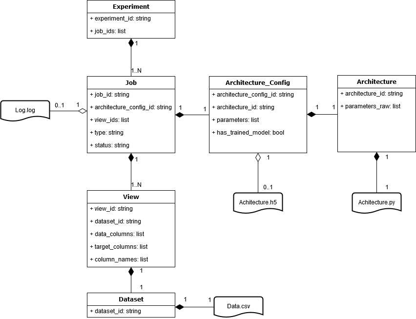

*Übersicht über die Ressourcen und deren Relation. Gewellte Ressourcen stellen Binärdateien dar. Obiges Diagramm zeigt 
die Datenfelder, welche für den grundlegenden Betrieb benötigt werden. Diese können jedoch beliebig erweitert werden.*

## 3.1	Datensatz
Bei einem Datensatz handelt es sich um eine Tabelle, wie Beispielsweise eine csv-Datei, welche aus mehreren Spalten 
besteht. Die enthaltenen Daten sind die Grundlage für die Durchführung von Trainings- und Vorhersageaufgaben. 
Die Ressource Datensatz kapselt diese Tabelle, weist ihr eine eindeutige ID zu und kann zusätzlich beispielsweise 
den Dateinamen speichern.

## 3.2	View
Eine View beschreibt die Struktur eines Datensatzes. Sie enthält die ID des Datensatzes und definiert für die einzelnen 
Spalten in welchem Kontext die Daten verwendet werden sollen. Hierbei kann es sich entweder um Rohdaten handeln, welche 
zum Erlernen von Zusammenhängen genutzt werden sollen, oder Zielwerte, welche das Ergebnis des zu erlernenden 
Zusammenhangs darstellen. Auch die Spaltennamen werden in der View gespeichert. Die Spaltennamen werden verwendet 
um kompatible Views zu erkennen. Kompatible Views sind Views, welche auf unterschiedliche Datensätze verweisen, die 
ansonsten jedoch identisch strukturiert sind.

## 3.3	Architektur
Architekturen sind Algorithmen, welche vom Benutzer für die Durchführung von Trainings- und Vorhersageaufgaben 
ausgewählt werden können. Hierbei kann es sich beispielsweise um neuronale Netze handeln. Jede Architektur besitzt 
Parameter, welche das Training beeinflussen. Diese Parameter können vom Benutzer vor Durchführung von Trainingsaufgaben
konfiguriert werden. Durch Vorgabe sinnvoller Werte für die jeweiligen Parameter und Eingrenzung auf bestimmte 
Wertebereiche ist es auch weniger erfahrene Benutzern möglich Architekturen zu konfigurieren.

Jede Architektur ist als Klasse und einer zugehörigen Konfigurationsdatei hinterlegt. Alle konkreten Architekturen müssen von der Klasse Algorithm erben. Diese dient als gemeinsames Interface und stellt Methoden zur Verfügung mit denen jede Architektur völlig transparent von ihrem Inhalt benutzt werden kann. Dadurch hat jeder Algorithmus die Methoden fit, evaluate, predict, save, load, und check_data vor. Die Funktionalität der ersteren ähnelt sich von Architektur zu Architektur, die Methode check_data dagegen implementiert das Überprüfen der Daten und Labels speziell für diesen Architekturtyp. Zum Beispiel darf der BinaryClassifier nur mit Labels der Werte Null oder Eins trainiert werden.

## 3.4	Architekturkonfiguration
In einer Architekturkonfiguration sind die vom User ausgewählte Architektur und die gewählten Parameter hinterlegt. 
Über die ID einer Architekturkonfiguration kann daher genau die Kombination aus Parametern und Architektur referenziert 
werden, auf welcher beispielsweise eine trainierte Architektur basiert.

## 3.5	Job
Ein Job stellt eine Kombination von View und Architekturkonfiguration dar, welche durch den Benutzer erstellt wird. 
Zusätzlich wird im Job hinterlegt, ob trainiert oder eine Vorhersage getroffen werden soll. Auch Statusmeldungen, der 
Fortschritt sowie Logdateien werden im Job gespeichert.

## 3.6	Experiment
Das Experiment stellt die höchste Abstraktionsebene der Ressourcen dar. Es fasst eine Liste von Jobs zusammen und 
ermöglicht das gesammelte Starten aller enthaltenen Jobs.

# 4	Komponenten
Die Grundfunktionalität des zu entwickelnden Systems lässt sich in folgende Aufgaben gliedern: Dateneingabe und 
Interaktion mit dem System über eine grafische Benutzeroberfläche, Speicherung der Daten, Steuerung der Datenverarbeitung 
und Durchführung von Trainings- und Vorhersageaufgaben.
Bei der Entwicklung des Systems wurde auf eine gute Skalierbarkeit und hohe Flexibilität in Bezug auf die verwendeten 
Programmiersprachen und Bibliotheken wert gelegt. Hierdurch sind drei Komponenten entstanden, welche über 
REST- und MQTT-Schnittstellen miteinander kommunizieren. Bei diesen Komponenten handelt es sich um die GUI, den Controller 
und den Worker.
 
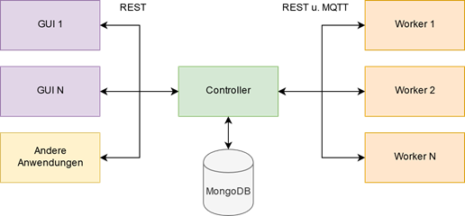

*Übersicht über die Komponenten im entwickelten System.*

## 4.1	GUI
Die GUI dient als Schnittstelle zwischen Benutzern und dem restlichen System, mit welchem über REST kommuniziert wird. Ziel bei der Entwicklung der Oberfläche war eine möglichst intuitive Benutzerführung bei gleichzeitig größtmöglicher Flexibilität. Die GUI wurde mit Angular, Typescript, HTML und CSS geschrieben. Vereinzelt wurden Bootstrap-Komponenten verwendet. Für die Icons wurde auf FontAwesome zurückgegriffen.

Optisch wurde die GUI bewusst schlicht gehalten, um den Nutzer nicht abzulenken oder zu verwirren. Als Hauptfarben wurden die Grautöne #808080, #343a40 und #f7f7f7 verwendet, als Signalfarbe für Dinge wie bewusst gewählte Überschriften, Actionbuttons, oder Hover-Effekte der Blauton #007bff. 
Als Schriftart für den Body Text wurde Open Sans gewählt. Diese Schriftart ist eine der am Häufigsten verwendeten Schriftarten im Web und fühlt sich somit für den Nutzer vertraut an.

Die Navigationsleiste ist eine Sticky-Navigation, die auch beim Scrollen durchgehend an ihrem Platz am oberen Rand bleibt und jederzeit bedient werden kann. Über sie kann auf die Unterseiten der Anwendung navigiert werden. Die Navigationsleiste bildet den Rahmen der Anwendung und alles was drunter passiert wird über ein sogenanntes Router-Outlet gesteuert.
Navigationsleisten und Cards haben einen Boxshadow, um die Einteilung zwischen verschiedenen Ebenen wie beispielsweise Navigationsmenüs und Cards zu verdeutlichen und die Seite dadurch übersichtlicher zu machen.
Da in vielen Cards unabhängig voneinander gescrollt werden kann, wurde entschieden die Scroll-Leiste ebenfalls optisch vom Browser Default abzuheben. Diese wird nun nur durch einen schmalen Streifen mit einem #0056b3 Streifen als Scroll-Fläche dargestellt.

Alle Elemente des User Interface werden dynamisch generiert und gefüllt. Die Oberfläche passt sich dem Backend, dem Nutzer, sowie der Nutzerbedienung in Echtzeit an.
Die jeweils vom Benutzer ausgewählten Daten werden im Webspeicher des Browsers hinterlegt, um nach einem Seitenwechsel oder Sitzungsunterbrechung mit dem letzten Stand die Erstellung eines Jobs oder eines Trainings fortsetzen zu können.
Die Oberfläche besteht aus mehreren Unterseiten, welche dem Benutzer jeweils verschiedene Handlungsmöglichkeiten bieten. Auf diese wird im Folgenden kurz eingegangen.

### 4.1.1 Home
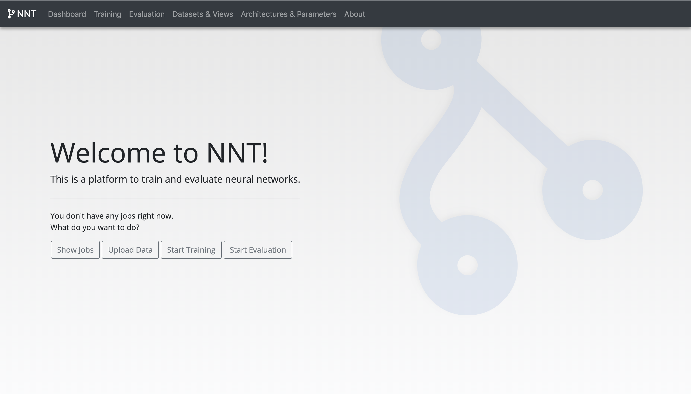

Zu Beginn, wenn der Benutzer auf die Seite kommt, ist der Homescreen die erste Seite die er zu sehen bekommt. Sie dient als Begrüßung und Übersicht welche Aktionen in dem Tool möglich sind. So werden ihm verschiedene Aktionen, wie z.B. ein neues Experiment zu starten, zur Auswahl gestellt, worüber er direkt zur jeweiligen Seite gelangt. Auf diese Startseite gelangt der Benutzer außerdem, indem er auf den Titel der Seite klickt.

### 4.1.2 Dashboard
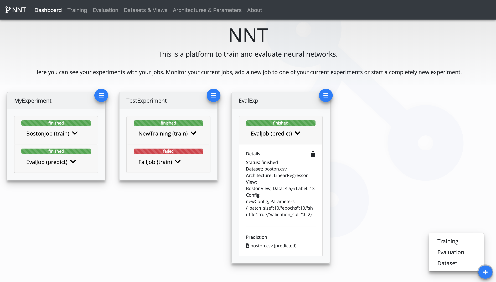

Das Dashboard gibt dem Benutzer eine Übersicht seiner verschiedenen Experimente und Jobs, sowie deren Fortschritt und Details. Der Ladefortschritt eines Experiments wird als Ladebalken über dem Job-Namen angezeigt. Während der Job lädt ist der Balken blau und animiert und der Fortschritt wird darin prozentual dargestellt. Am Ende kann der Job zwei Zustände haben „finished“ oder „failed“. In beiden Fällen wird die Animation angehalten. Außerdem wird der Balken je nach Zustand grün oder rot und der jeweilige Status wird angezeigt.
 Als Hintergrund besitzt die Startseite einen Gradienten unter dem Header Bereich, sowie ein sanft unterlegtes Icon, das an die Neuronen in einem Neuronalen Netz erinnern soll, um die Seite lebendiger und dynamischer wirken zu lassen. 
 Hat der User noch keine Experimente oder Jobs angelegt, kann er diese über einen Plus-Button im rechten unteren Eck hinzufügen. Hat er hingegen bereits Experimente, werden diese als Cards auf dem Dashboard angezeigt. Der Header der Card beinhaltet den Namen des jeweiligen Experiments, im Body der Cards befinden sich die Jobs als weitere untergeordnete Cards, deren Header den jeweiligen Job Namen beinhaltet, sowie einen Fortschrittsbalken, der den Fortschritt des Trainings oder der Evaluation visualisiert. Ein Klick auf einen Job klappt weitere Details auf, wie Beispielsweise den verwendeten Datensatz, die genuzte Architektur und berechnete Parameter wie z.B. Loss. Jedes Experiment bietet rechts oben eine Schaltfläche in Form eines Actionbuttons, um weitere Jobs hinzuzufügen, wobei zwischen Trainings- und Evaluations-Job gewählt werden kann. Diese leiten den Benutzer entsprechend zum Trainings- oder Evaluations-Flow weiter. Alternativ können die Flows über das Navigationsmenü erreicht werden. Als weiterer Anhaltspunkt für den Benutzer, eine Aktion zu tätigen, ist der in der unteren, rechten Ecke der Seite platzierte Floating Action Button, der auch beim beliebigen Scrollen auf der Seite an seinem Platz bleibt. Wird dieser gedrückt, kann der User über ein am Actionbutton erscheinendes kleines Menü auswählen, ob ein Training oder eine Evaluation beginnen möchte, oder einen neuen Datensatz hochladen will.
 Die Flows für Training und Evaluation sind in den folgenden Activity Diagrammen dargestellt und werden anschließend genauer erläutert.

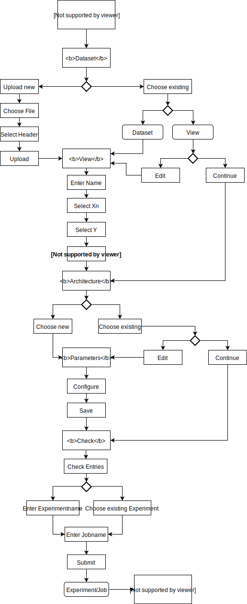&nbsp;&nbsp;&nbsp;&nbsp;&nbsp;&nbsp;&nbsp;&nbsp;&nbsp;&nbsp;&nbsp;&nbsp;&nbsp;&nbsp;&nbsp;&nbsp;&nbsp;&nbsp;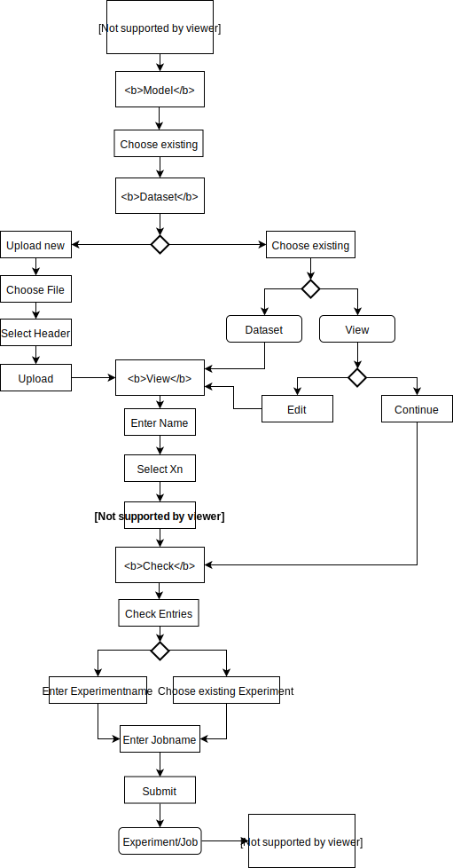

### 4.1.3 Training
Auf dieser Seite wird der Benutzer Schritt für Schritt durch den Prozess geführt, um einen Trainingsjob für ein Experiment zu erstellen. 
 Die Seite besteht linksseitig aus einer Timeline, die die einzelnen Schritte beinhaltet, die der Nutzer tätigen muss. Jeder Schritt steht dabei also für eine Funktion des Trainings. Der jeweilige Timeline-Schritt, der gerade aktiv ist, wird hervorgehoben. Zusätzlich ist die Timeline optisch durch Kreise visualisiert, die die Titel der Schritte optisch mit der Card verbinden. Diese Titel werden ebenfalls hervorgehoben werden, wenn der Benutzer sich gerade auf der entsprechenden Seite befindet. Sie enthalten außerdem Verlinkungen zu den entsprechenden Unterseiten, sodass auf diese sowohl über die Timeline als auch über „Next“- und „Back“-Buttons navigiert werden kann. Das Besondere im Training, wie auch in der Evaluation ist, dass zwischen den Seiten beliebig hin und hergesprungen werden kann, wobei bereits getroffene Einstellungen trotzdem auf den Seiten erhalten bleiben, da diese gespeichert werden. Es reicht dazu die ID von Dataset, View, Config oder Architektur im lokalen Webspeicher zu legen.
 Rechtsseitig besteht die Trainingsseite aus einer Card, in der der jeweilige Inhalt des aktuellen Timeline-Steps angezeigt wird. Die Cards besitzen jeweils Header und Footer. Im Header ist beschrieben was in diesem Schritt zu tun ist. Der Footer hingegen zeigt dem Benutzer seine Auswahl oder Einstellung an, die er in diesem Schritt getroffen hat. Außerdem enthält er den „Next“- und „Back“-Button und in manchen Schritten einen Save Button, um die Einstellungen auf dem Server zu speichern. Die Buttons „Next“ und „Save“ sind solange disabled bis der User eine Auswahl und die notwendigen Einstellungen getroffen hat, um mit dem nächsten Schritt fortzufahren. Das unterstützt den User dabei zu erkennen welche Angaben notwendig sind und verhindert gleichzeitig, dass ein Training unvollständig ist.
 Die Cards befinden sich immer an ihrem Platz ebenso wie der Header und der Footer, der Inhalt der Cards ist unabhängig davon scrollbar. Innerhalb mancher Cards sind einzelne Inhaltselemente unabhängig voneinander scrollbar.

#### Training - Dataset
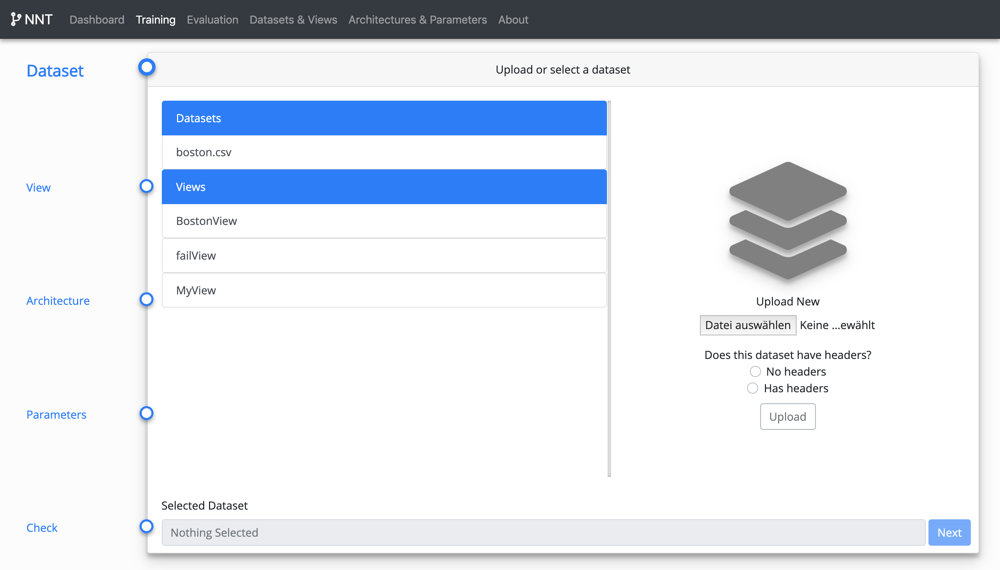

Auf der linken Seite der Card ist eine scrollbare Liste zu finden, die mit den vom User bereits hochgeladenen Datensätzen und bereits erstellten Views gefüllt ist. Existieren noch keine Datasets oder Views, wird das ebenfalls angezeigt. In diesem Schritt kann der Benutzer einen Datensatz oder eine View auswählen, oder im Feld rechts einen Datensatz hochladen. Lädt er einen Datensatz hoch, erscheint dieser ebenfalls automatisch in der Liste links.  Die Upload Fläche auf der linken Seite wird durch ein Stack Icon visualisiert und beinhaltet einen FileChooser, über den die Datei ausgewählt werden kann, die hochgeladen werden soll. Außerdem muss der User an dieser Stelle angeben ob diese Datei Header besitzt oder nicht, was später in der Darstellung und beim Training berücksichtig werden muss. Diese Angabe erfolgt über zwei Radiobuttons. An letzter Stelle steht der Upload Button, der zu Beginn disabled ist. Erst wenn sowohl eine Datei gewählt wurde als auch die Headerauswahl getroffen wurde, wird dieser enabled. Mit einem Klick auf den Upload Button wird der Fileupload auf den Server ausgelöst und der Datensatz erscheint in Echtzeit in der Übersicht. 

#### Training - View
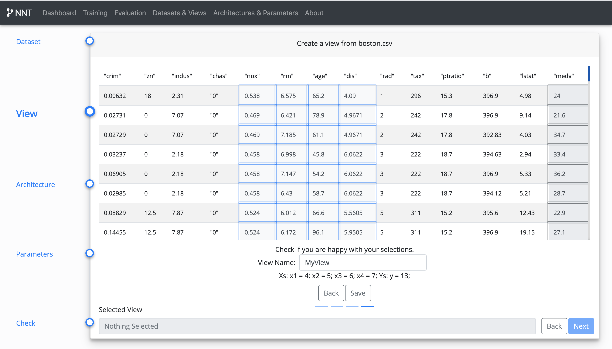

Hat der User einen Datensatz gewählt sieht er im Header noch einmal den Datensatznamen, sowie die Aufforderung, eine View zu erstellen. Hat er hingegen eine View gewählt gelangt er direkt in die View-Ansicht, die am Ende dieses Abschnitts beschrieben wird.
 Der Datensatz wird in Form eines BLOBs auf dem Server gespeichert und von der GUI heruntergeladen. Anschließend wird er dort ausgelesen, zerteilt und als Tabelle dargestellt. Diese ist in der Mitte der Card vollständig zu sehen, in der Tabelle kann unabhängig vom Rest des Card-Inhalts gescrollt werden. Aus Performance Gründen werden nur die ersten 100 Zeilen des Datensatzes abgebildet. Datensätze können eine enorme Größe haben, was die Ladezeit deutlich erhöhen kann, aber 100 Zeilen sind ausreichend damit der User die notwendigen Angaben treffen kann. Als Feedback wird ein Loading-Screen mit Spinner angezeigt bis die Tabelle fertig geladen ist.
 Unter der Tabelle befindet sich dann ein 4-Seitiger horizontaler Slider, mit dem der User durch den Prozess der View Erstellung geleitet wird. Damit kann dieser Prozess auch für Amateurnutzer so einfach und fehlerfrei wie möglich gestaltet werden. Es sind vier Orientierungsstriche zu sehen, die dem User verdeutlichen, auf welcher Slide er sich gerade befindet. Mit diesen kann alternativ zur Navigation mit „Next“- und „Back“-Buttons zwischen den Slides navigiert werden. Für eine bessere User-Führung sind sowohl die „Next“-Buttons als auch der „Save“-Button am Ende wieder disabled bis der User die erwarteten Einstellungen getroffen hat.

**Slide 1: Viewname** 
Zu Beginn, ist die erste Slide mit einem Textfeld für den Namen der View zu sehen, den der Benutzer eingeben muss.

**Slide 2: X Columns** 
Hier wird der Nutzer aufgefordert, die X-Spalten, d.h. die Daten für das Training auszuwählen indem er mit der Maus auf die gewünschten Spalten der Tabelle klickt. Die gewählte Spalte wird mit ihrem Index in ein Array hinzugefügt und bekommt dadurch eine Klasse zugewiesen, sodass sie eine blaue Markierung bekommt. Im Slider erscheinen die gewählten X-Spalten Indices zusätzlich textuell dargestellt. Klickt der User auf eine bereits ausgewählte Spalte, wird diese wieder aus der Auswahl entfernt.

**Slide 3: Y Columns** 
Hier wird der User aufgefordert, Y-Spalten, dh. die Labels für das Training auszuwählen. Das Prinzip und der Aufbau der Seite ist gleich wie in der vorherigen Slide. Lediglich die Markierung der Y-Spalten ist Dunkelgrau, um diese von den X-Spalten abzusetzen. 

**Slide 4: Check** 
Hier überprüft der User seine Eingaben: Den View-Namen und die X- und Y-Spalten, die immer noch markiert in der Tabelle angezeigt werden. Der User kann nun im Slider oder über die „Back“-Buttons zurück navigieren, um Korrekturen zu treffen, oder seine Einstellungen über den „Save“-Button speichern.

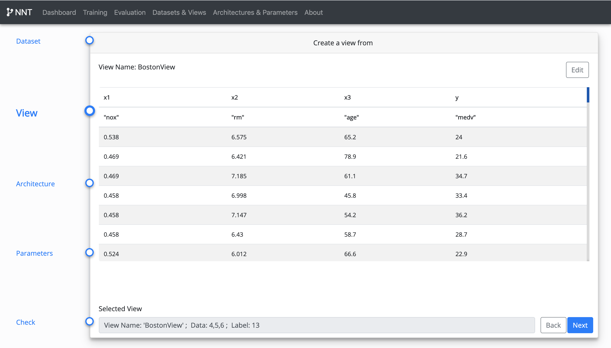

Sobald die Auswahl gespeichert wird verschwindet das Dataset und der Slider. Die Card zeigt nun alle View-Informationen an und die erstellte View als Tabelle. Außerdem gibt es einen „Edit“-Button, mit dem der User wieder in den Bearbeitungsmodus mit der Slideshow gelangt. Ist der User mit seiner View zufrieden, kann er im Footer überprüfen, ob die korrekte View ausgewählt wurde, und mit dem „Next“-Button auf den nächsten Timeline-Schritt navigieren.

#### Training - Architecture
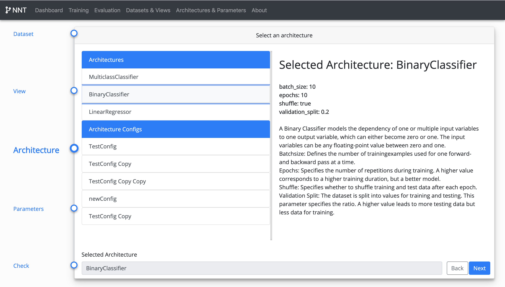

Links befindet sich eine Liste, die alle Architekturen und bereits vom User erstellten Architektur- Konfigurationen anzeigt. Existieren noch keine Architektur-Konfigurationen, wird das ebenfalls angezeigt. Rechts zeigt die Card dem User nach der Auswahl einer Architektur oder Konfiguration alle zugehörigen Informationen und Parameter an.

#### Training - Parameters
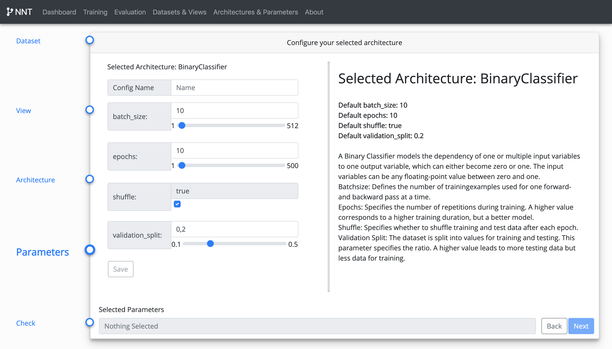

Hat der Benutzer eine Architektur gewählt kann er sie in diesem Schritt konfigurieren. Hat er hingegen eine bereits fertige Konfiguration gewählt gelangt er direkt in die Konfigurationsübersicht.
 Um eine Architektur-Konfiguration zu erstellen müssen die Parameter der gewählten Architektur eingestellt werden. Dafür befindet sich Links ein Einstellungsfeld, in dem der Name und die Parameterwerte der Konfiguration angegeben werden können. Während der Name über ein Textfeld eingegeben werden kann, werden die Parameter entweder als Nummernfeld mit Slider oder als Checkbox mit disabled Textfeld dargestellt, um sie zu verändern. Die Darstellung wird dabei flexibel an die Parameter angepasst und hängt vom jeweiligen Typ des Parameters ab, der sowohl numerisch als auch ein Boolean sein kann. Außerdem sind die beiden Elemente miteinander verknüpft, d.h. eine Änderung im Slider führt automatisch zu einer Änderung im Nummernfeld und andersherum. Ähnlich verhält es sich mit der Checkbox und dem disabled Textfeld, wobei hier allerdings nur die Checkbox das Textfeld beeinflusst und nicht andersherum, da es weniger Sinn macht den Boolean manuell einzugeben. Für die gewählte Architektur werden alle verfügbaren Parameter über REST abgefragt und wie beschrieben dynamisch angezeigt. Die Parameterinputs sind von vornherein mit den Default Werten der Parameter bestückt und dienen als Orientierung für eine realistische Werteinschätzung. Auch die maximal und minimal Werte, sowie die Schrittweite der Slider sollen der User dabei unterstützen passende Angaben zu machen. Unter den Parameterinputs befindet sich ein „Save“-Button, der die Konfiguration auf dem Server speichert und in die Konfigurationsansicht wechselt. Die Textfelder oder Slider sind in dieser Ansicht nicht mehr bearbeitbar. Allerdings ist es dem User auch im Nachhinein möglich Änderungen an der Konfiguration vorzunehmen falls z.B. etwas vergessen wurde. Dafür gibt es einen „Edit“-Button, der den Nutzer wieder in den editierbaren Modus leitet.
 Rechts auf der Seite sind die Informationen und Default-Werte der verwendeten Architektur zu sehen, damit der User stets erkennen kann mit welcher Architektur er gerade arbeitet und sich an den Default-Werten orientieren kann.

#### Training - Check
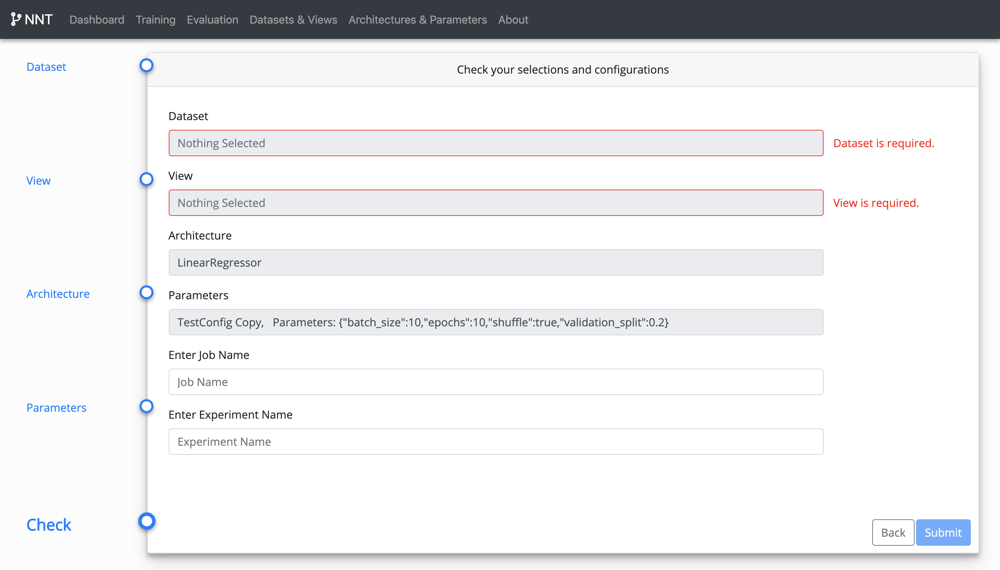

Im letzten Schritt erhält der User hier eine Übersicht seiner gewählten Einstellungen, damit er diese noch einmal überprüfen kann. Der Datensatz, die View-Einstellungen, die Architektur, sowie die Konfiguration der Architektur werden zu diesem Zweck in deaktivierten Textboxen angezeigt. Über zwei Textfelder wird der Benutzer außerdem aufgefordert den aktuellen Job und das Experiment zu benennen. Die Eingabe eines Experimentnamens ist nur notwendig, wenn der Nutzer ein neues Experiment anlegt. Wird hingegen nur ein Job zu einem Experiment hinzugefügt ist dieses Feld bereits mit dem richtigen Experimentamen bestückt und deaktiviert. 
 Rechts unten befindet sich der „Submit“-Button, mit dem der Nutzer den Job starten kann. Hat der Benutzer einen Schritt vergessen, bzw. sind nicht alle Felder ausgefüllt, wird das entsprechende Textfeld rot markiert und ein ebenfalls roter Schriftzug weißt den User darauf hin welches Feld noch auszufüllen sei. Der Submit Button ist ebenfalls solange deaktiviert bis alle Angaben für einen Job vollständig sind. Damit wird garantiert, dass dem Job alle Ressourcen zu Verfügung stehen, um fehlerfrei durchzulaufen und gleichzeitig, dass der User auf Fehler hingewiesen wird, um den Prozess besser zu verstehen. Im Falle einer Korrektur kann über „Zurück“ oder das Menüband zur jeweiligen Seite gewechselt und Korrekturen vorgenommen werden. Mit einem Klick auf den „Submit“-Button startet der Training-Job und erscheint auf dem Dashboard, worauf der User in diesem Moment weitergeleitet wird.

### 4.1.4 Evaluation
Die Evaluation Seite ist im Grundlegenden so aufgebaut wie die Training Seite, links eine Timeline mit den Evaluations-Schritten, rechts eine Card die mit dem Inhalt gefüllt wird. Header, Footer und Buttons sind ebenfalls wie im Training angeordnet und haben dieselbe Funktionalität. Allerdings unterscheiden sich die Schritte in der Evaluation ein wenig, wie im Folgenden erläutert wird.

#### Evaluation - Model
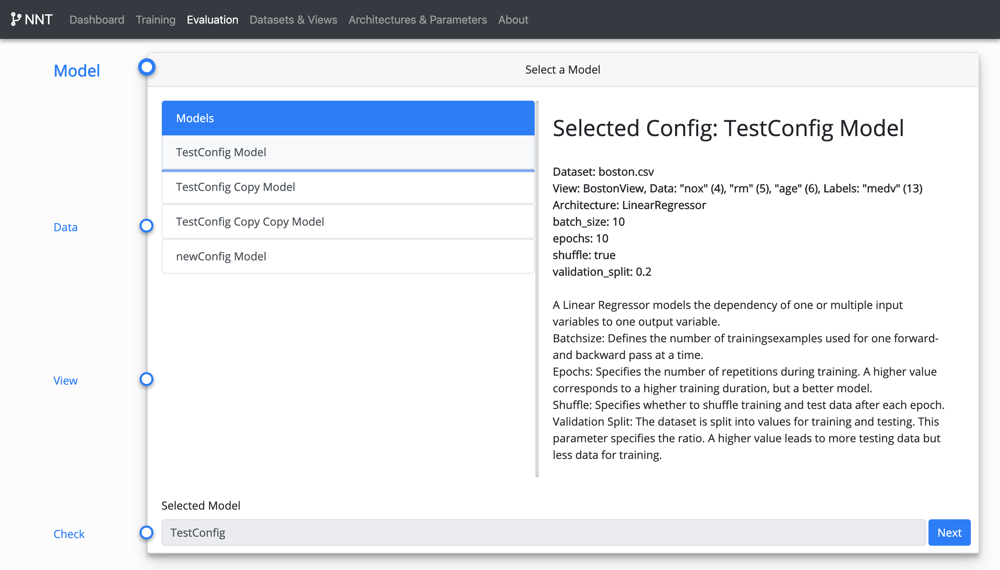

Als ersten Schritt in der Evaluation wählt der User ein Modell aus. Links in der Card befindet sich dafür eine Liste mit allen bisher trainierten Modellen und rechts die Informationen zum ausgewählten Modell, wie z.B. die im Training verwendete View. Existieren noch keine Modelle wird das dem User ebenfalls angezeigt. Um genauer zu sein werden an dieser Stelle Architektur-Konfigurationen angezeigt, die bereits auf ein Modell trainiert wurden. Ob eine Konfiguration ein fertiges Modell besitzt oder nicht kann über einen gespeicherten Boolean festgestellt werden und nur diese werden an der Stelle angezeigt.

#### Evaluation - Data
Identisch wie in Training – Dataset: Hier kann der User entweder links ein bestehendes Dataset oder eine View auswählen, oder rechts einen neuen Datensatz hochladen. Das Besondere ist allerdings, dass bei den Views angezeigt wird welche kompatibel zu der View des Models sind. Diese sollten ausgewählt werden, um eine sinnvolle Evaluation zu erhalten.

#### Evaluation - View
Identisch wie Training – View. Hier erstellt der User mithilfe der geführten Slideshow eine View aus dem gewählten Datensatz. Allerdings unterscheidet sich der Prozess dadurch, dass diesmal keine Y-Spalten, d.h. keine Labels, gewählt werden müssen denn diese werden in der Evaluation erzeugt. Der User wird zusätzlich darauf hingewiesen. Diese Evaluation-Views können im Training nicht verwendet werden und werden aus diesem Grund dort auch nicht angezeigt. 

#### Evaluation - Check
Identisch wie Training – Check: Hier überprüft der User seine Einstellungen. Ist etwas nicht ausgewählt oder eingestellt, wird der User darauf hingewiesen und der „Submit“-Button ist nicht anwählbar. Über Textfelder können wieder die Namen des Jobs und Experiments eingegeben werden. Der Submit startet diesmal einen Evaluations-Job, der ebenfalls auf dem Dashboard erscheint, worauf der User weitergeleitet wird.

### 4.1.5 Datasets & Views
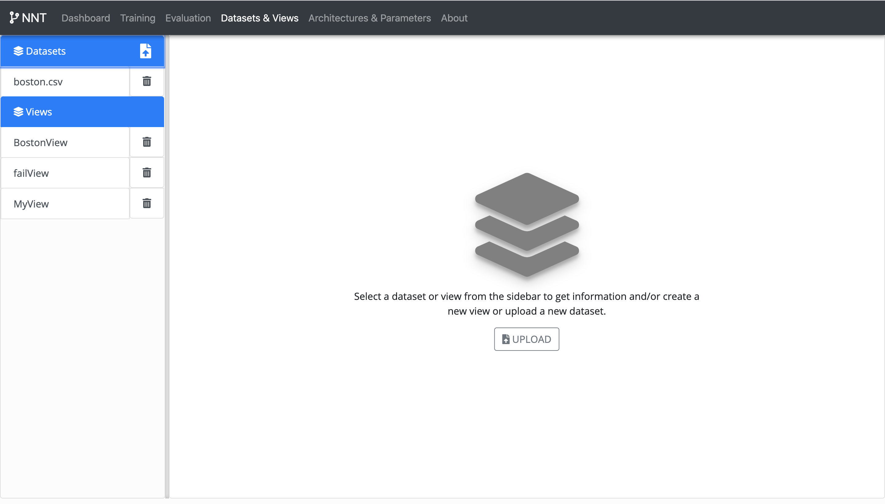

Hier erhält der User eine Übersicht seiner Datasets und Views und kann sich diese mit Details anzeigen lassen. Außerdem können unabhängig von einem Job Datasets hochgeladen, sowie Views erstellt und gespeichert werden. 
 Links befindet sich eine Navigationsleiste mit einer Liste aller bereits hochgeladener Datasets und erstellten Views. Sind noch keine Datasets oder Views vorhanden, wird das in der Liste ebenfalls angezeigt. Den größten Teil der Seite nimmt eine Fläche zum Hochladen neuer Datensätze ein. Auf der Fläche befindet sich mittig ein Stack-Icon und ein „Upload“-Button, um einen Datensatz hochzuladen. In der Liste neben der Überschrift „Datasets“ ist ein zusätzliches Upload-Icon zu finden über das der Nutzer von jeder Unterseite wieder zurück auf die Upload-Ansicht geleitet wird. Lädt der User einen Datensatz hoch, wird dieser in eine HTML-Tabelle umgewandelt und angezeigt. Der Benutzer kann den Datensatz in dieser Form zuerst einmal komplett einsehen und überprüfen, ob es sich um den handelt, den er hochladen möchte. Unter der Tabelle befindet sich ein Textfeld, das mit dem Namen der ausgewählten Datei ausgefüllt ist. Hier kann der User aber auch einen eigenen Namen eingeben, unter dem er sein Dataset speichern möchte. Außerdem muss er über zwei Radiobuttons spezifizieren, ob der Datensatz Header besitzt oder nicht. Die Tabelle passt sich dann der Auswahl des Nutzers automatisch an, indem sie die Header-Zeile entsprechend markiert.  Der Button zum Speichern kann erst betätigt werden, wenn beide Angaben vorhanden sind, davor ist er disabled. Nach dem Speichern erscheint der Name des Datensatzes in der Liste und die Seite mit seinen Details und Funktionen wird angezeigt. 
 Die Datensatzanzeige erscheint ebenfalls, wenn der User einen der schon gespeicherten Datensätze aus der Liste auswählt. Dabei wird im rechten Feld der Datensatz als Tabelle angezeigt und dessen zugehörige Views aufgelistet. Mögliche angezeigte Funktionen auf dieser Seite sind das Umbenennen des Datensatzes und Erstellen einer View. Über einen „Create View“-Button öffnet sich die Slideshow, die den Benutzer durch den Prozess führt, wie es bereits in Training – View beschrieben wurde. Mithilfe eines „Cancel“-Button kann der User den Vorgang jederzeit abbrechen und wird wieder auf die Anzeige des Datensatzes geleitet. Führt der User alle in der Slideshow angegeben Anweisungen aus und speichert die View, wird er zur View-Ansicht weitergeleitet. Auf diese Ansicht gelangt er auch wenn er eine bestehende View aus der Liste auswählt. Dabei kann der Nutzer alle Details der View einsehen: den zugehörigen Datensatz, die Data und Label Spalten, und den Namen. Darunter wird die View als Tabelle dargestellt, mit den X und Y Bezeichnern als zusätzliche Überschriften.

### 4.1.6 Architectures & Parameters
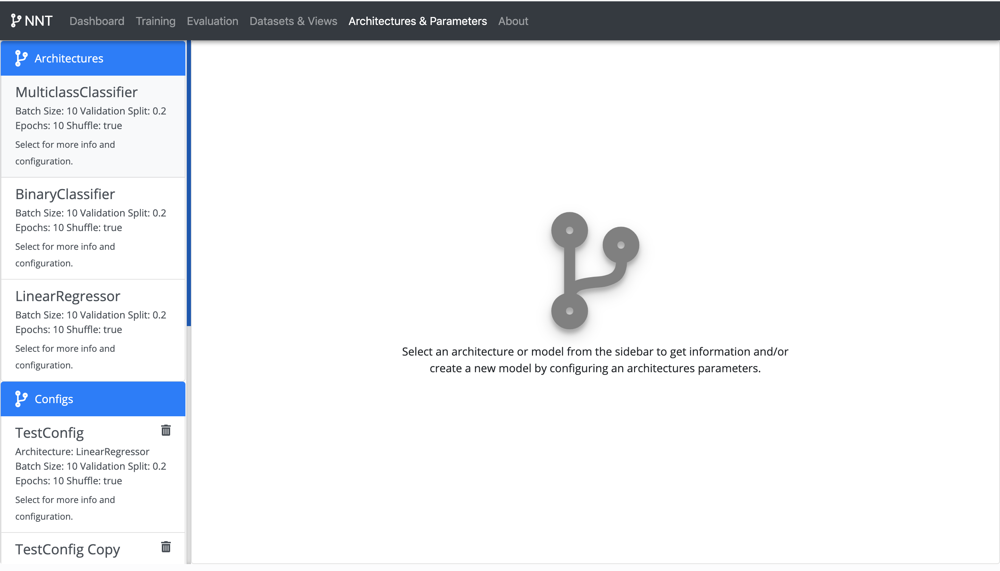

Hier kann der Nutzer vorgegebene Architekturen und seine eigenen erstellten Konfigurationen einsehen. 
 Links ist wieder eine Liste mit den Architekturen und Konfigurationen inklusive ihrer Parameter, um eine schnelle Übersicht zu erhalten. Im Bereich rechts befindet sich anfangs ein Neuronales-Netz-Icon und eine Anweisung an den Nutzer etwas auszuwählen, um weitere Informationen zu erhalten. Sobald der Nutzer eine Architektur aus der Liste auswählt, erscheint in diesem Bereich eine zweigeteilte Seite. Links sind die Details der Architektur zu sehen und rechts ist ein Einstellungsfeld, in dem der Nutzer eine Architektur-Konfiguration erstellen kann. Dieses Einstellungsfeld ist im Aufbau und in der Funktion identisch, wie es im Punkt Training – Config bereits vorgestellt wurde. Speichert der Nutzer hier eine Konfiguration, erscheint diese in der Liste der linken Navigationsleiste und der Nutzer wird auf deren Ansicht weitergeleitet. Dort kann er Informationen über die Konfiguration und deren zugehöriger Architektur finden, und die Konfiguration noch einmal bearbeiten. Diese Ansicht öffnet sich ebenfalls, wenn eine gespeicherte Konfiguration aus der Liste angewählt wird.

### 4.1.7 About
Die „About“-Seite beinhaltet eine Kurzbeschreibung des Projekts. Hier werden allgemein Informationen, sowie Ziele des Projekts aufgeführt. Außerdem befindet sich hier eine Beschreibung der verwendeten Ressourcen, falls der Nutzer noch nichts mit den Begriffen anfangen kann. Für diese Seite wird ein Auto-Margin verwendet, um den Fließtext besser darzustellen.

### 4.1.8 Modal Dialoge
An verschiedenen Stellen des Interfaces ist es dem User möglich, nicht rückgängig machbare Aktionen auszuführen. Diese Aktionen werden auf jeder Seite durch einen Popup Modal Dialog begleitet, in welchem der User seine Aktion bestätigen kann, oder diese wieder abbrechen. Für diese Modalfenster wurde der Service *ModalService* erstellt, welcher von jeder Seite aus verwendet werden kann und aktionsspezifisch angepasste Modal Fenster öffnet und schließt. 
 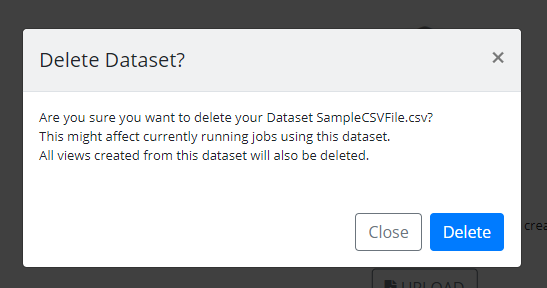

### 4.1.9 REST-Service
Der REST-Service verwendet einen Http-Client, um mit dem Server zu kommunizieren. Durch entsprechende Methoden werden in dem Service die REST-Befehle POST, PUT, GET, DELETE und PATCH abgebildet. Ihnen müssen Parameter wie der Typ (dataset, view, architecture, architecture config), die ID und entsprechende JSON-Konfigurationen übergeben werden aus denen der REST-Pfad gebildet wird. Die Methoden liefern als Rückgabewert die Http-Response, die in der GUI umgesetzt wird. Dabei bieten sogenannte Observables Unterstützung für die Weitergabe von Nachrichten zwischen Publishern (Server) und Abonnenten (GUI Komponenten) der Anwendung. Observables sind deklarativ, d.h. Sie definieren eine Funktion zur Weitergabe von Werten, aber sie wird erst ausgeführt, wenn ein Verbraucher sie abonniert. Um die Benachrichtigungen zu erhalten, muss die Methode subscribe() der Instanz aufgerufen und ein Observer-Objekt übergeben werden. Der Abonnent erhält solange Benachrichtigungen, bis die Funktion abgeschlossen ist oder er sich abmeldet (unsubscribe). Observables können je nach Kontext mehrere Werte beliebigen Typs liefern, z.B. Literale, Nachrichten oder Ereignisse. (https://angular.io/guide/observables)

### 4.1.10 Dynamische Erzeugung
Ein großer Vorteil der GUI ist, dass die einzelnen Seiten dynamisch generiert werden. Dadurch passt sich das Frontend dem Backend an, d.h. Änderungen oder Erweiterungen im Backend können ohne Anpassungen im Frontend umgesetzt werden. So werden zum Beispiel Überschriften, Bezeichnungen, Labels und ganze Beschreibungstexte je nach ausgewähltem Datentyp aus den JSON-Dateien ausgelesen und an der richtigen Stelle in angepasster Formatierung (CSS) angezeigt.
 Des Weiteren werden die Input-Elemente für die Einstellungen der Parameter (Configs) dynamisch erzeugt. Je nach Typ generiert die Seite einen Checkbox-, Textfield-, Number- oder Slider-Input, wobei die Input-Elemente selbst ebenfalls dynamisch bestückt werden. Dazu werden iterativ aus der JSON-Liste der Parameter bestimmte Eigenschaften, wie Minimum und Maximum, oder Default-Werte ausgelesen und im HTML-Code eingebunden. Die Schrittweite der Slider- und Number-Inputs kann aus diesen Werten ebenfalls berechnet werden.
 Auch die IDs, Namen und Klassen der DOM-Elemente werden dynamisch erstellt, wodurch es teilweise schwieriger wird im Code auf diese zuzugreifen, sowie es von Angular vorgeschlagen wird. Das liegt daran, dass die Elemente nicht von vornherein in den Typescript-Klassen gebunden werden können, da die Ids und Namen zu Beginn noch nicht bekannt sind und erst erzeugt werden müssen. Dieses Problem tritt bei den Slidern auf, weshalb auf die Werte über ein eingebundenes Dom-Objekt zugegriffen wird. 
 NgModel leistet aber in den meisten Fällen Abhilfe für dieses Problem. Durch sogenanntes Two-Way-Binding können Variablen im Funktionscode direkt mit denen im HTML-Code verknüpft werden. 

## 4.1.11 Responsiveness
Die gesamte Webapplikation passt sich an alle geläufigen Bildschirmgrößen sowie Auflösungen an. Dies wurde mit Hilfe von CSS Media Queries sichergestellt, welche exakt für jedes Oberflächenelement und jede Bildschirmauflösung angepasst wurden.
  Links ein Bildschirm mit einer Breite von 884px, rechts ein Bildschirm mit einer Breite von 1440px.
 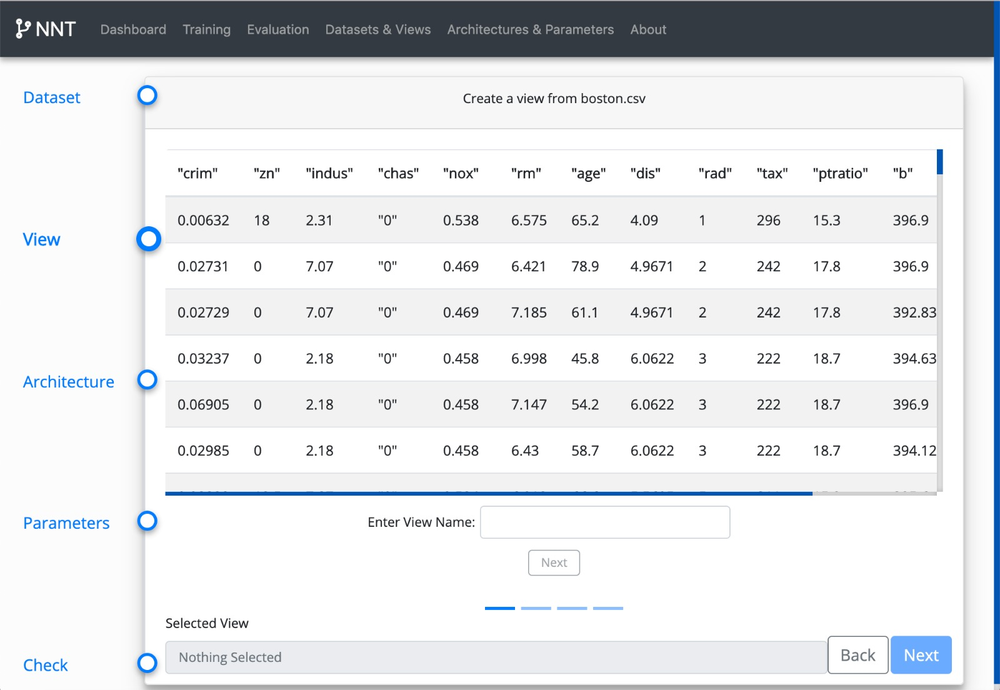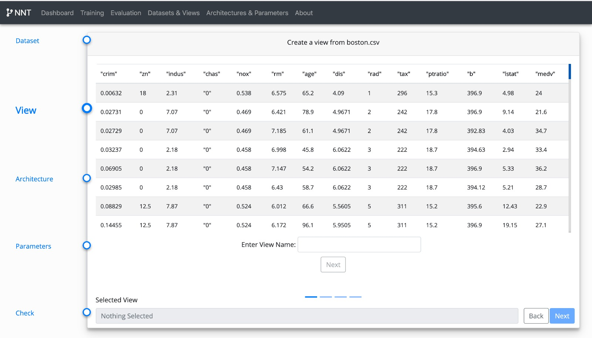

## 4.2	Controller
Der Controller ist zentraler Bestandteil des entwickelten Systems. Er übernimmt die Aufgabe der Speicherung aller 
relevanter Daten und Ressourcen, wie Beispielsweise Datensätze, Architekturen und Konfigurationen. Zusätzlich koordiniert 
der Controller die Aufgabenverteilung an beliebig viele Worker-Einheiten.

### 4.2.1	Ressourcen und deren Speicherung
Die Kommunikation zwischen Controller und GUI erfolgt über eine REST-Schnittstelle über welche Datensätze und 
Konfigurationen erstellt, gespeichert und abgefragt werden können. Zusätzlich kann die Durchführung von Experimenten 
über REST gesteuert werden. Die Manipulation der Daten erfolgt über verschiedene Pfade und Methoden. Die REST-Pfade 
beginnen immer mit dem Namen der Ressource und sind ansonsten nach dem gleichen Muster aufgebaut. Hierüber können Einträge 
hinzugefügt, gelöscht und geändert werden. Jeder dieser Einträge besteht aus dem Erstellungs- und Änderungszeitpunkt, 
einer ID und dem Besitzer der Ressource. Diese Datenfelder werden automatisch bei Erstellung des Eintrags generiert und bei 
Änderungen aktualisiert. Alle weiteren Einträge sind optional und können beliebig strukturiert und bezeichnet werden. 

Die erste voll funktionsfähige Version des Controllers prüfte noch alle Datenfelder einer Ressource einzeln und speicherte 
diese individuell ab. Durch diese enge Kopplung musste der Controller bei jeder Änderung der Ressourcen komplett 
überarbeitet werden, was einen großen Mehraufwand darstellte. Deswegen wurde der Controller überarbeitet, sodass dieser 
die Datenfelder und den relationalen Zusammenhang der einzelnen Ressourcen nicht mehr kennen musste. Hierdurch können 
die Ressourcen beliebig modifiziert werden, ohne dass aufwändige Änderungen am Controller notwendig werden. 
Die zu speichernden Konfigurationen liegen im JSON-Datenformat vor. Die Speicherung erfolgt in einer dokumentenorientierten 
Datenbank namens MongoDB. Hierdurch muss eine JSON-Nachricht nicht auf Spalten aufgeteilt werden, um Beispielsweise einzelne 
Einträge indizieren zu können, sondern kann als ein Gesamtdokument gespeichert werden. Dies bietet auch den Vorteil das eine 
JSON-Struktur um beliebige Einträge erweitert werden kann, ohne dass die Struktur der Datenbank angepasst werden muss.

### 4.2.2	REST-Methoden
Für die entwickelte REST-Schnittstelle wurden folgende Methoden explizit implementiert: POST, PUT, PATCH, DELETE und GET. 

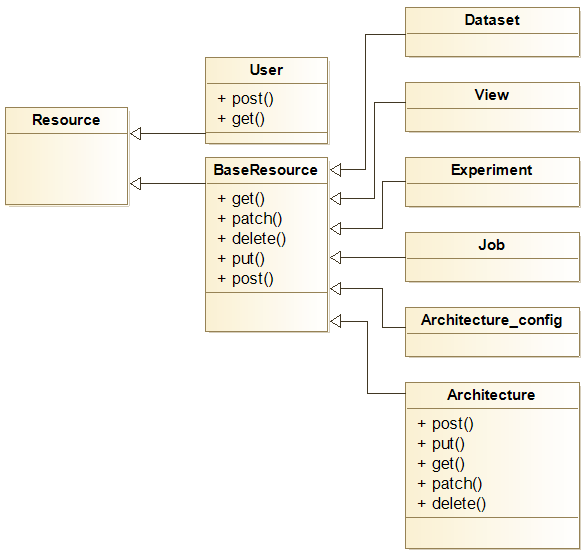

*Übersicht über die verschiedenen Ressourcen-Klassen und die implementierten REST-Methoden. Lediglich die Klassen 
Architecture und User müssen aufgrund ihrer Funktionsweisen REST-Methoden individuell implementieren. Die Klasse 
Architecture überschreibt beispielsweise alle REST-Methoden, da diese bis auf GET nicht unterstützt werden und GET nicht 
wie andere Ressourcen mit der Datenbank, sondern mit dem Dateisystem interagieren muss.*

Die Verwendung der POST-Methode erlaubt die Erstellung eines neuen Eintrags einer Ressource. Hierbei wird eine ID für den 
Eintrag generiert und kann aus der Antwort, welche den erzeugten Eintrag enthält, entnommen werden.
Über ein PUT ist das Überschreiben eines Eintrags möglich. Damit die GUI nicht immer den gesamten Eintrag kennen muss, 
um einzelne Datenfelder modifizieren zu können, wurde ebenfalls die 
PATCH-Methode implementiert. Hierüber können JSON-Patch Strukturen übergeben werden, anhand welcher der Controller die 
bestehenden Datenfelder modifiziert.

Über die Methode DELETE ist es möglich Einträge zu löschen. Hierbei wurde darauf geachtet, dass Binärdateien automatisch 
gelöscht werden, sobald die zugehörige Konfiguration gelöscht wird, da diese sonst nicht mehr erreichbar wären. 
Des Weiteren ist es wichtig, dass nur Einträge gelöscht werden, welche in keinem anderen Eintrag verwendet werden, da 
hierdurch Inkonsistenzen entstehen würden.

Die Methode GET erlaubt die Abfrage von Einträgen. Wird ein GET auf eine Ressource ohne Angabe einer ID durchgeführt, 
wird eine Liste aller verfügbaren IDs zurückgeliefert. Bei Angabe einer ID hingegen der jeweilige Eintrag.
Um beispielsweise eine Übersicht aller vorhandenen Datensätze abzufragen, ist eine GET-Anfrage auf /datasets möglich. 
Der Rückgabenwert ist eine Liste aller Datensatz-IDs. Um hingegen den Inhalt der Konfiguration auszugeben ist eine 
GET-Anfrage auf /datasets/\<ID\> notwendig. Da die GUI zur Anzeige vieler verschiedener Konfigurationen viele GET-Anfragen 
stellen müsste, wurde zusätzlich die Möglichkeit implementiert, alle Konfigurationen über eine einzelne Anfrage zu erhalten. 
Hierfür kann anstelle der ID ein Sternchen angegeben werden, wodurch der Controller alle Einträge in eine Liste 
kombiniert und diese zurück liefert.

Alle Dateien, welche ausgetauscht werden müssen, werden ebenfalls via REST übertragen. Hierbei handelt es sich 
beispielsweise um die Datensätze als csv-Datei, trainierte Modelle und Logdateien. Diese Dateien werden nicht in der 
Datenbank, sondern im Dateisystem gespeichert. Um hierbei mögliche Probleme mit ungültigen Zeichen und doppelten 
Dateinamen zu umgehen, wird der Dateiname durch die ID des Datensatzes ersetzt. Da der originale Dateiname für die 
weitere Verarbeitung nicht benötigt wird, kann dieser entweder komplett weggelassen, oder in der Konfiguration des 
Datensatzes gespeichert werden.  Der Austausch der Binärdateien ist über ein PUT bzw. GET möglich. Der Pfad der Binärdatei 
setzt sich aus dem Pfad für die jeweilige Konfiguration (z.B. /datasets/\<dataset_id\>) und dem Pfad /bin/\<data\> zusammen. 
\<data\> kann hierbei beliebig ersetzt werden, um mehrere Binärdateien speichern zu können und die Art der gespeicherten 
Datei anzugeben. Für Logdateien kann beispielsweise /jobs/\<job_id\>/bin/log verwendet werden.

Alle Ressourcen bestehen aus individuellen Klassen, welche alle von der selben Basisklasse ableiten. Die Basisklasse 
implementiert die gesamte REST-Funktionalität für alle REST-Methoden. Die einzelnen Kindklassen überschreiben lediglich 
den Namen der Ressource. Durch dies Architektur ist eine Erweiterung um neue Ressourcen mit geringem 
Implementierungsaufwand durchführbar. Lediglich im Falle einer abweichenden Funktionsweise einer Ressource muss die 
jeweilige REST-Methode explizit implementiert werden. Dies ist Beispielsweise für das Starten von Experimenten und Jobs 
notwendig, einer Funktionalität, welche andere Ressourcen nicht unterstützen.

### 4.2.3	Ausführung von Jobs und Experimenten

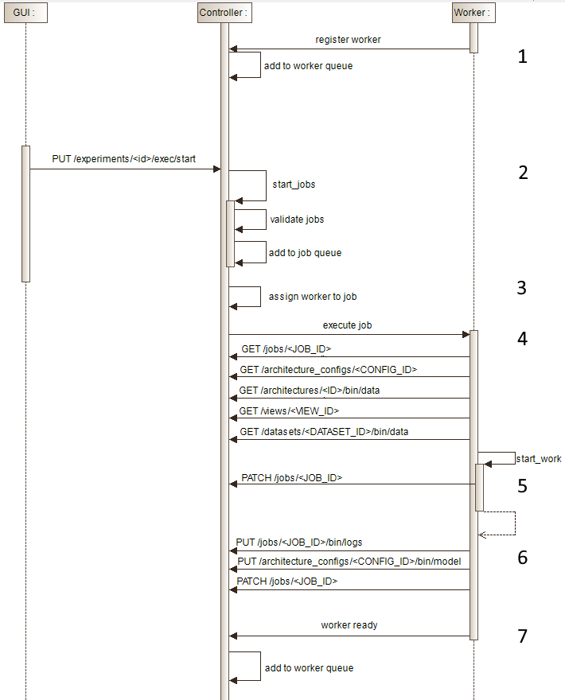

*Ablauf der Ausführung eines Experiments mit einem Trainings-Job.* 

Beim Starten eines Workers registriert sich dieser automatisch beim Controller und werden von diesem in eine Warteschlange eingereiht (Punkt 1).
Wird zu einem späteren Zeitpunkt ein Experiment gestartet, werden alle enthaltenen Jobs ebenfalls in eine zweite Warteschlange 
eingereiht, validiert und sequentiell den Worker-Einheiten zugewiesen, wie in obiger Abbildung ab Punkt 2 sichtbar ist. 
Sobald sowohl ein freier Worker als auch ein Job aus den Warteschlangen entnommen werden können, wird der 
Job dem Worker zugewiesen und beide aus den Warteschlangen entfernt (Punkt 3). Der Controller sendet über MQTT eine 
Nachricht an den Worker, welche die Job-ID enthält. Über diese Job-ID kann der Worker alle relevanten Informationen 
über die REST-Schnittstelle vom Controller abfragen und mit der Verarbeitung beginnen. Der Worker nutzt hierbei dieselbe 
REST-Schnittstelle, welche auch von der GUI verwendet wird (Punkt 4).  Während der Ausführung der Aufgaben kann über 
PATCH-Anfragen der Status des Jobs aktualisiert werden (Punkt 5). Wenn der Worker mit der Verarbeitung fertig ist 
speichert er die generierten Daten und meldet dies dem Controller (Punkt 6). Dieser reiht den Worker wieder in die
Warteschlange ein (Punkt 7). Aktuell existieren für Worker und Jobs jeweils nur eine Warteschlange. 
Bei künftigen Erweiterungen wäre es möglich mehrere Wartschlangen mit unterschiedlichen Prioritäten zu verwenden, 
wodurch unterschiedliche Prioritätsmodelle angeboten werden könnten.

### 4.2.4	Authentifizierung
Um auf Ressourcen zugreifen zu können, müssen sich die Benutzer und die Worker beim Controller authentifizieren. 
Dies geschieht über ein BasicAuth genanntes Verfahren, bei welchem der Benutzername und das Passwort in der 
REST-Anfrage mit übertragen werden. Die Übertragung der Daten geschieht hierbei im Klartext, weswegen dieses Verfahren 
für ein Produktivsystem nicht geeignet ist. Für das Testen der Zugriffskontrolle und Authentifizierung ist es jedoch 
ausreichend. Der Controller prüft bei Erhalt einer REST-Anfrage den Benutzernamen und das Passwort auf Richtigkeit und 
ob der angeforderte Ressourceneintrag dem Benutzer gehört. 

Auch der Worker muss sich dem Controller gegenüber Authentifizieren, hat jedoch im Gegensatz zu normalen Benutzern 
Zugriff auf alle Ressourceneinträge, da der Worker als Vertrauenswürdig angesehen wird. Durch diese Zugriffsrechte 
besteht die theoretische Möglichkeit, dass Nutzer über den Worker Ressourcen verwenden können, die ihnen nicht gehören. 
Hierfür müsste der Nutzer die Ressourcen-ID eines anderen Nutzers erraten und diese ID im Job verwenden. 
Dies ist aufgrund der 64 Bit langen ID und mangels Prüfungsmöglichkeit als normaler Benutzer über die REST-API unwahrscheinlich. 
Dennoch wird deswegen die Korrektheit der Besitzverhältnisse beim Starten eines jeden Jobs für alle enthaltenen Ressourcen rekursiv verifiziert.
 
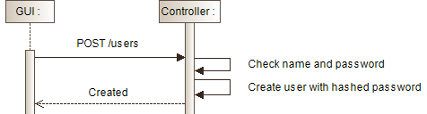

*Erstellung eines neuen Benutzers*

Die Registrierung eines neuen Benutzers erfolgt ebenfalls über REST. Hierbei kann über eine POST-Anfrage auf die 
Ressource User (/users) ein neuer Benutzer angelegt werden. Es wird geprüft, ob ein Benutzer mit demselben Namen bereits 
existiert. Ist dies nicht der Fall, wird der Benutzername und der Hash des Passworts in der Datenbank abgelegt. 
 
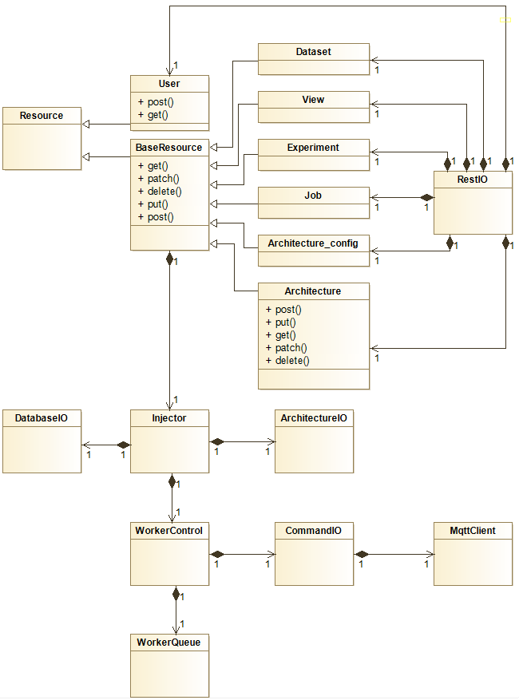

*Klassendiagramm des Controllers (Funktionen und Member, mit Ausnahme der REST-Methoden, wurden zur Verbesserung der 
Übersichtlichkeit weggelassen)*

Da das Framework Flask, welches für die REST-Funktionalität verwendet wird, die Instanzen der Ressourcen-Klassen selber 
erstellt, ist es nicht möglich, Abhängigkeiten über Setter oder Konstruktor-Parameter zu injizieren und hierbei die 
statische Typsicherung zu verwenden. Deswegen wird der Zugriff auf die Ressourcen über eine Klasse Injector implementiert, 
welcher alle weiteren benötigten Klassen kennt. 

### 4.2.5	Skalierbarkeit
Der Controller, sowie alle anderen Komponenten können als Docker-Container betrieben werden. Die Anzahl der verwendeten 
Worker und GUI-Server kann beliebig skaliert werden. Dies kann beispielsweise über docker-swarm und docker-compose 
gesteuert werden. Hierbei können die einzelnen Services über eine Konfigurationsdatei beschrieben und gesteuert werden. 
Auch der für MQTT benötigte Broker, sowie die Datenbank stehen als Docker-Container zu Verfügung, wodurch das gesamte 
System mit einem einzelnen Befehl `docker-compose up` auf einem einzelnen Rechner oder mittels `docker stack deploy` 
über mehrere Rechner verteilt gestartet werden kann. Auch die Verwendung von Kubernetes zur Steuerung und Verwaltung der 
Container ist möglich.

Die Worker registrieren sich beim Starten automatisch beim Controller und werden bei Verbindungsverlust über die Funktion 
des letzten Willens von MQTT auch automatisch wieder entfernt. Es wurde abgewogen, ob Worker direkt bei Systemstart 
oder erst bei tatsächlichem Bedarf gestartet werden sollen.  Das bedarfsgesteuerte Starten hätte die Entwicklung einer 
zusätzlichen Komponente erfordert, welche den Worker steuert. Zusätzlich hätte diese Komponente auf allen Computern 
installiert und ausgeführt werden müssen. Diese Verteilung hätte entweder über docker-swarm realisiert werden können, 
wodurch Container jedoch deutlich ausgeweitete Rechte auf dem jeweiligen System benötigt hätten, oder manuell geschehen 
müssen, was einen deutlichen Mehraufwand dargestellt hätte. Des Weiteren wäre durch den notwendigen Startvorgang 
des Workers eine zusätzliche Latenz zwischen dem Starten des Jobs und der tatsächlichen Ausführung auf dem Worker entstanden. 
Deswegen werden die Worker bei Systemstart automatisch über docker-swarm gesteuert gestartet, sie registrieren sich 
automatisch am Controller und warten anschließend auf eine Jobzuweisung. Das Warten geschieht über blockierende Warteschlange, 
wodurch dies sehr Ressourcenschonend sein sollte.

## 4.3	Worker
Der Worker ist für die Durchführung von Trainings- und Vorhersageaufgaben zuständig. DIe Anforderung an den Worker ist zum einen als isoliertes System reproduziert werden zu können, um hohe Skalierbarkeit zu erreichen, als auch generisch Trainings- und Predictionjobs ausführen zu können, welche über Konfigurationsdateien spezifiziert werden.

Der Worker ist via MQTT mit dem Controller verbunden und abonniert einen Kanal auf dem er informiert wird, sobald ein Job gestartet werden soll. Empfangene Jobs werden in einer Queue gespeichert. Sobald sich ein Job in dieser Queue befindet, löst sich ein Blockingcall, der den Initialisierungsprozess für einen Job auslöst. 
Dabei werden alle relevanten Konfigurationsdateien vom Server erfragt, ein temporäres Verzeichnis angelegt und ein paar Logeinträge geschrieben. Anhand des Eintrags in der Job Konfigurationsdatei *type* wird zwischen einem Traings- und Predictjob unterschieden. Der Worker hat ebenfalls eine Klasse KerasCallback, welche einen CustomCallback implementiert. Dieser hat eine Referenz der api, um nach jeder Epoche den Fortschritt des Jobs auf dem Server zu aktualisieren. Am Ende des Trainings wird noch der Status des Jobs auf finished gesetzt.

### Trainingsjob
Bei einem Trainingsjob lädt der Worker eine untrainierte Architektur vom Server. Diese wird als String abgespeichert und zur Laufzeit kompiliert. Dadurch kann das Modell instanziiert werden. Zuerst werden die Daten und Labels anhand der View und der Dataset_id vom Server geholt. Durch die Methode model.train() wird die Architektur trainiert. Es wird das trainierte Modell sowie Logs und der gezippte Inhalt des kompleten temporären Ordners auf den Server geladen. Abschließend wird noch der Status des Jobs auf finished gesetzt.

### Predictjob
Ein Predictjob beginnt mit dem Herunterladen eines Modells vom Server, dieses ist dort als .h5 Datei hinterlegt und kann mit der Methode tf.keras.models.load_model instanziert werden. Die Daten werden wieder vom Server geholt und das Modell durch die Methode model.predict ausgewerted. Abschließend werden die Predictions auf den Server geladen.

In beiden Fällen werden alle temporären Daten und Verzeichnisse gelöscht, daduruch bleibt die Dateistruktur im Worker aufgeräumt.

# 5	Fazit
Im Rahmen dieses Projektes wurde ein System entwickelt, welches auch fachfremden Personen die Verwendung maschinellen Lernens ermöglicht. 
Über eine grafische Weboberfläche können hierbei eigene Datensätze hochgeladen und verschiedene Parameter individuell konfiguriert werden. 
Die verschiedenen Komponenten sind durch die Verwendung von REST und MQTT als Schnittstellen nur lose gekoppelt und beliebig erweiterbar, 
wodurch das Ziel der Flexibilität und guten Skalierbarkeit umgesetzt wurde. 
Auch ist hierüber professionellen Anwendern die Anbindung eigener Software und die automatische Steuerung des Systems möglich. 
Durch die Kapselung der Komponenten in Docker-Container wurde die Verteilung der Komponenten über verschiedene Rechner weiter vereinfacht.
In zukünftigen Versionen wäre es zudem möglich, die Auswahl an bestehenden Architekturen um ein Baukastensystem zu erweitern, über welches Nutzer mit einfachen 
Mitteln neue Architekturen erstellen und nutzen können.

