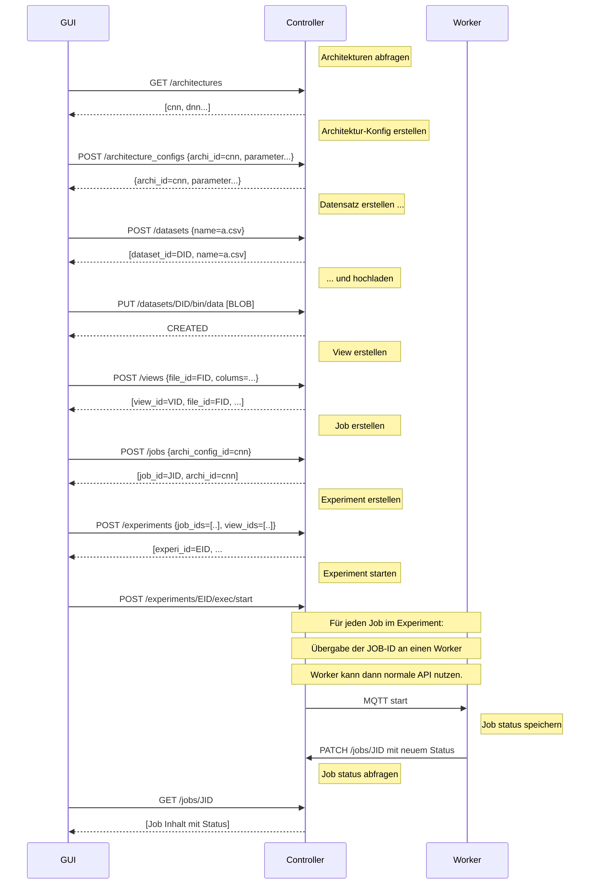
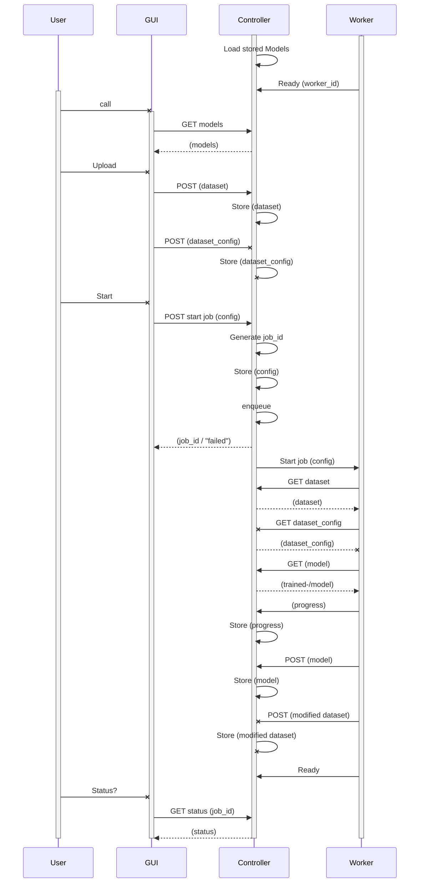

# Data and application flows

```mermaid
sequenceDiagram
    participant GUI
    participant Controller

    Note right of Controller: Architekturen abfragen
    GUI->>Controller: GET /architectures
    Controller -->> GUI: [cnn, dnn...]
    
    Note right of Controller: Architektur-Konfig erstellen
    GUI->>Controller: POST /architecture_configs {archi_id=cnn, parameter...}
    Controller -->> GUI: {archi_id=cnn, parameter...}

    Note right of Controller: Datensatz erstellen ...
    GUI->>Controller: POST /datasets {name=a.csv}
    Controller -->> GUI: [dataset_id=DID, name=a.csv]

    Note right of Controller: ... und hochladen
    GUI->>Controller: PUT /datasets/DID/bin/data [BLOB]
    Controller -->> GUI: CREATED

    Note right of Controller: View erstellen
    GUI->>Controller: POST /views {file_id=FID, colums=...}
    Controller -->> GUI: [view_id=VID, file_id=FID, ...]
    
    Note right of Controller: Job erstellen
    GUI->>Controller: POST /jobs {archi_config_id=cnn}
    Controller -->> GUI: [job_id=JID, archi_id=cnn]

    Note right of Controller: Experiment erstellen
    GUI->>Controller: POST /experiments {job_ids=[..], view_ids=[..]}
    Controller -->> GUI: [experi_id=EID, ...

    Note right of Controller: Experiment starten
    GUI->>Controller: POST /experiments/EID/exec/start 

    Note over Controller,Worker: Für jeden Job im Experiment: 
    Note over Controller,Worker: Übergabe der JOB-ID an einen Worker
    Note over Controller,Worker: Worker kann dann normale API nutzen.
    Controller->>Worker: MQTT start

    Note right of Worker:  Job status speichern
    Worker->>Controller: PATCH /jobs/JID mit neuem Status

    Note right of Controller: Job status abfragen
    GUI->>Controller: GET /jobs/JID
    Controller -->> GUI: [Job Inhalt mit Status]
```

# User Interface flows
**Training Flow**

 

**Evaluation Flow**

**Below is deprecated**

```mermaid
sequenceDiagram
    participant User
    participant GUI
    activate Controller
    activate Worker
    Controller->>Controller:Load stored Models
    Worker->>Controller:Ready (worker_id)

    activate User
    User-xGUI:call
    activate GUI

    GUI->>Controller:GET models
    Controller-->>GUI: (models)

    User-xGUI:Upload
    GUI->>Controller:POST (dataset)
    Controller->>Controller:Store (dataset)
    GUI-xController:POST (dataset_config)
    Controller-xController:Store (dataset_config)

    User-xGUI:Start
    GUI->>Controller:POST start job (config)
    Controller->>Controller:Generate job_id
    Controller->>Controller:Store (config)
    Controller->>Controller:enqueue
    Controller-->>GUI:(job_id / "failed")

    Controller->>Worker:Start job (config)

    Worker->>Controller:GET dataset
    Controller-->>Worker:(dataset)
    Worker-xController:GET dataset_config
    Controller--xWorker:(dataset_config)
    Worker->>Controller:GET (model)
    Controller-->>Worker:(trained-/model)

    Worker->>Controller:(progress)
    Controller->>Controller:Store (progress)

    Worker->>Controller:POST (model)
    Controller->>Controller:Store (model)
    Worker-xController:POST (modified dataset)
    Controller-xController:Store (modified dataset)
    Worker->>Controller:Ready

    User-xGUI:Status?
    GUI->>Controller:GET status (job_id)
    Controller-->>GUI:(status)
    deactivate User
    deactivate GUI
    deactivate Controller
    deactivate Worker
```

