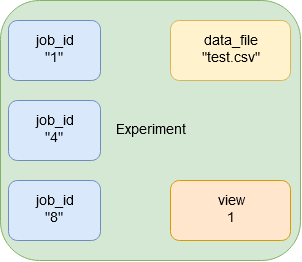

# THIS PAGE IS DEPRECATED. USE THE INDIVIDUAL PAGES INSTEAD
# Configuration

This page describes the JSON structure used for configuration in our project.

## Job config
A job is the definition of the model to be used as well as its config (e.g. batchsize).

### Hyper parameters
Training parameters, which can be configured using the webpage, should be described in a JSON file stored together with the corresponding architecture. Upon startup, available architectures and their configuration are sent to the webpage.

A example for such a configuration for the architecture 'architecture_XY' can be seen below. It should be stored together with the source code used to generate the architecture and the generated architecture (eg. h5 file).

**To GUI**
```
{
    "internal_name": "architecture_XY", // Must be unique and equal to the filename to be used for training/evaluation 
    "parameters": [
        {
            "batch_size": {
                "default": 30,
                "validation": {
                    "numeric": {
                        ">": 0,
                        "float": false
                    }
                }
            }
        },
        {
            "learning_rate": {
                "default": 0.01,
                "validation": {
                    "numeric": {
                        ">=": 0,
                        "<=": 10
                    }
                }
            }
        }
    ]
}
```
Using the example above, the webpage should show two input fields for the batch size and the learning rate. User input is validated using the corresponding validation entries.

The webpage needs to know what text to display as the input name and description. Therefore the webpage should request a localised description (eg. "Hey backend, I need to get the descriptions in german").
All descriptions are stored in a single JSON file, like the one below.

**To GUI**
```
{
    "localisation" : {
        "batch_size" : {
            "de" : {
                "text" : "Batch-Größe",
                "desc" : "TODO"
            },
            "eng" : {
                "text" : "Batch size",
                "desc" : "TODO"
            }
        },
        "learning_rate" : {
            "de" : {
                "text" : "Lernrate",
                "desc" : "Rate, mit welchem gelernt wird"
            },
            "eng" : {
                "text" : "Learning rate",
                "desc" : "Rate of learning"
            }
        }
    }
}
```

### Config filled out by GUI
The config used to define a job equals the model configuration, except that the JSON-object is replaced by the actual value entered by the user, e.g:

**From/To GUI**
```
{
    "internal_name": "architecture_XY", // Must be unique and equal to the filename to be used for training/evaluation
    "job_id" : "abcd",
    "parameters": [
        {
            "batch_size": 30
        },
        {
            "learning_rate": 0.01
        }
    ]
}
```
The above config is passed to the controller, which generates a unique id for the configuration and adds it to the above JSON-config.

### Config for worker
The config passed to the worker is a combination of data from other configurations. Its structure is described below:

**To WORKER**
```
{
    "internal_name": "architecture_XY", // Must be unique and equal to the filename to be used for training/evaluation 
    "job_id": "a1b2-asdf",
    "dataset": "a.csv"
    "view": 2
    "parameters": [
        {
            "batch_size": 30
        },
        {
            "learning_rate": 0.01
        }
    ]
}
```

## Datasets
### Storing Datasets
After uploading a dataset, the file is stored in the backend. If everything works out, the stored filename is returned. This has not be the same as the one specified during upload (e.g. Invalid chars are stripped).

### Configuring Datasets
It is required to describe the dataset. This can be achieved using column headings. 

**From/To GUI**
```
{
    "config": {
        "filename": "a.csv",
        "headings": ["name", "alter", null, "klasse", "note", "note_leer"],
        "views": [
            {
                "name": "optional_name",
                "data": ["alter", "klasse"],
                "labels": ["note"],
                "predict":[]
            },
            {
                "data": ["alter", "klasse"],
                "labels": [],
                "predict":["note_leer"]
            }
        ]
    }
}
```

## Experiments
A experiment is a collection of jobs executed on the same dataset. 



**Stored**
```
{
    "Notenrelation": {
        "data_file": "a.csv",
        "view": 2,
        "job_ids": ["a1b2-asdf", "x3a4-qwer", "1123-5813"]
    },
    "Weiteres Experiment": {
        "data_file": "a.csv",
        "view": 1,
        "job_ids": ["d8c7-b3k1", "foo-bar"]
    }
    
}
```

When exchanging experiments with the Controller, only sections from the experiment config above are exchanged. The section to exchange is defined by the id given in the rest topic.

**From/To GUI**
```
{
    "data_file": "a.csv",
    "view": 2,
    "job_ids": ["a1b2-asdf", "x3a4-qwer", "1123-5813"]
}
```